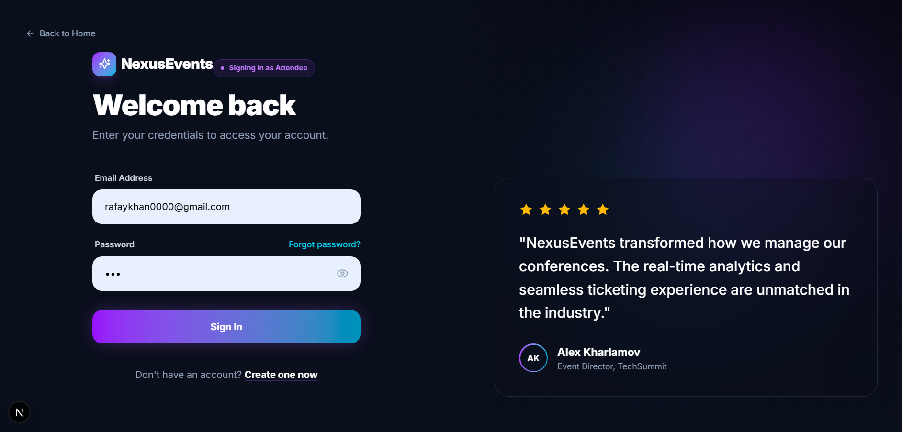
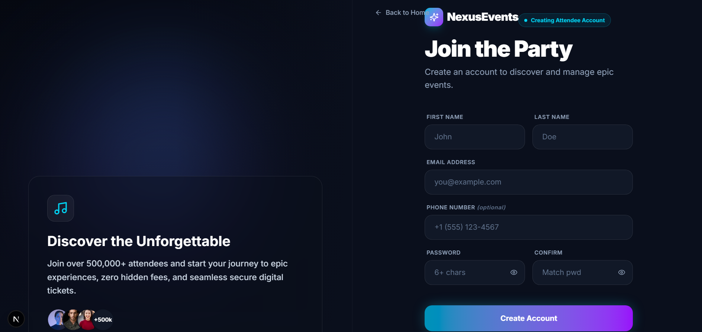

<h1 align="center">
  
</h1>

<h1 align="center">⚡ NexusEvents</h1>
<p align="center">
  <strong>A full-stack, production-ready event ticketing platform built with .NET 9 &amp; Next.js 15</strong>
</p>

<p align="center">
  
  
  
  
  
</p>

<p align="center">
  <a href="http://localhost:3000"><strong>🌐 Frontend</strong></a> &nbsp;·&nbsp;
  <a href="http://localhost:5251/swagger"><strong>📖 API Docs</strong></a> &nbsp;·&nbsp;
  <a href="#-getting-started"><strong>🚀 Quick Start</strong></a>
</p>

---

## 📸 Screenshots

<table>
  <tr>
    <td><p align="center"><b>Home Page</b></p></td>
    <td><p align="center"><b>Events</b></p></td>
  </tr>
  <tr>
    <td><p align="center"><b>Event Detail</b></p></td>
    <td><p align="center"><b>Venues</b></p></td>
  </tr>
  <tr>
    <td><p align="center"><b>Checkout</b></p></td>
    <td><p align="center"><b>Successful Checkout</b></p></td>
  </tr>
  <tr>
    <td><p align="center"><b>Login</b></p></td>
    <td><p align="center"><b>Sign Up</b></p></td>
  </tr>
</table>

---

## ✨ Features

### 🎟️ For Attendees
- Browse and search events by category, date, price, and location
- Detailed event pages with venue info, ticket types, and availability
- Secure Stripe-powered checkout with promo code support
- Ticket management dashboard with status tracking
- Venue explorer with interactive details

### 🏢 For Organizers
- Full organizer dashboard with revenue and attendance analytics
- Create, edit, publish/unpublish events
- Ticket type management (GA, VIP, Early Bird, etc.)
- Promo code system — percentage or fixed discounts
- Multi-language support (EN, ES, FR, DE, IT)
- Customizable theme: light/dark mode, accent colors, font sizes

### 🔐 Authentication & Roles
- JWT-based auth with role-aware login/register flows
- Roles: `Attendee`, `Organizer`, `Admin`, `SuperAdmin`
- Registering at `/register?role=organizer` grants Organizer access automatically

---

## 🛠️ Tech Stack

| Layer | Technology |
|---|---|
| **Frontend** | Next.js 15 (App Router), TypeScript, Tailwind CSS v4 |
| **Backend** | ASP.NET Core Web API (.NET 9) |
| **Database** | PostgreSQL + Entity Framework Core |
| **Auth** | JWT Bearer Tokens |
| **Payments** | Stripe Elements |
| **Icons** | Lucide React |
| **Testing** | xUnit (.NET) |
| **CI/CD** | GitHub Actions |

---

## 🏗️ Project Structure

```
NexusEvents/
├── EventTicketing.API/          # .NET 9 REST API
│   ├── Controllers/             # Auth, Events, Venues, Orders, Tickets, Analytics...
│   ├── Models/
│   │   ├── Entities/            # EF Core database models
│   │   └── DTOs/                # Request / response shapes
│   ├── Services/                # Business logic layer
│   ├── Data/                    # DbContext + seeder
│   └── Migrations/              # EF Core migrations
│
├── EventTicketingfrontend/      # Next.js 15 frontend
│   └── src/
│       ├── app/                 # App Router pages
│       │   ├── events/          # Event listing & detail
│       │   ├── venues/          # Venue listing & detail
│       │   ├── checkout/        # Stripe checkout
│       │   ├── mytickets/       # Ticket management
│       │   ├── organizer/       # Organizer dashboard
│       │   ├── login/           # Login (role-aware)
│       │   └── register/        # Register (role-aware)
│       ├── components/          # Shared UI components
│       ├── hooks/               # useAuth, useTheme...
│       └── lib/                 # API client helpers
│
├── EventTicketing.Tests/        # xUnit test project
├── assets/                      # Screenshots
└── .github/workflows/           # CI pipeline
```

---

## 🚀 Getting Started

### Prerequisites

- [.NET 9 SDK](https://dotnet.microsoft.com/download)
- [Node.js 18+](https://nodejs.org/)
- [PostgreSQL](https://www.postgresql.org/download/)

### 1. Clone & Configure

```bash
git clone https://github.com/abdulrafayKhan-10/Nexus-Events.git
cd Nexus-Events
```

Update the connection string in `EventTicketing.API/appsettings.json`:

```json
"ConnectionStrings": {
  "DefaultConnection": "Host=localhost;Database=NexusEvents;Username=postgres;Password=yourpassword"
}
```

### 2. Run the Backend

```bash
cd EventTicketing.API
dotnet ef database update   # Apply migrations & seed data
dotnet run                  # Starts on http://localhost:5251
```

### 3. Run the Frontend

```bash
cd EventTicketingfrontend
npm install
npm run dev                 # Starts on http://localhost:3000
```

### ⚡ One-command Start (Windows)

```bash
./start-enhanced.bat
```

### Access Points

| Service | URL |
|---|---|
| Frontend | http://localhost:3000 |
| API | http://localhost:5251 |
| Swagger UI | http://localhost:5251/swagger |

---

## 🔑 Demo Accounts

Register fresh accounts using the role-aware flows:

| Role | URL |
|---|---|
| **Attendee** | `/register` or `/register?role=attendee` |
| **Organizer** | `/register?role=organizer` |

---

## 🧪 Running Tests

```bash
cd EventTicketing.Tests
dotnet test
```

---

## 👨‍💻 Developer

**Abdul Rafay Khan** — Full Stack Developer

<p>
  <a href="https://github.com/abdulrafayKhan-10">
    
  </a>
</p>

---

<p align="center">Made with ❤️ using .NET 9 &amp; Next.js 15</p>
